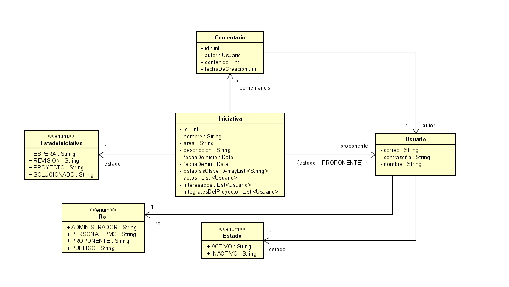
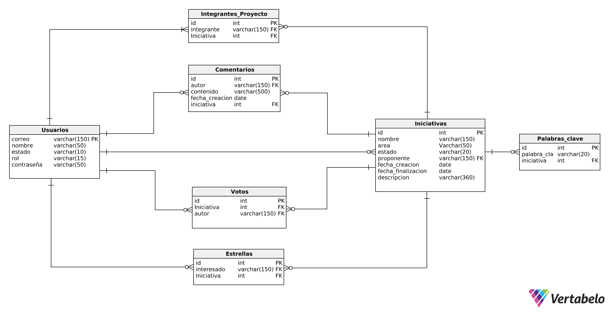

# ECI-Banco-de-Proyectos

La Plataforma banco de iniciativas de proyectos, es una herramienta donde la comunidad universitaria de la Escuela Colombiana de Ingeniería Julio Garavito pueden registrar sus iniciativas e ideas de proyectos para ser desarrollados o gestionados por la PMO de la Escuela.

### Integrantes
- Laura Bernal  (Developer Team)
- Davor Cortés  (Scrum Master)
- Juan Sebastian Diaz  (Developer Team)
- Juan Camilo Ortiz  (Developer Team)

### Profesor
- Oscar David Ospina  (Product Owner)

## Diagrama de clases
- Paquete de Entidades

## Diagrama Entidad Relacion
- Modelado Físico de la Base de Datos

> Universidad: _Escuela Colombiana de Ingeniería_
>
> Asignatura:  _Ciclos de Vida del Desarrollo de Software_
>
> 2020-1

